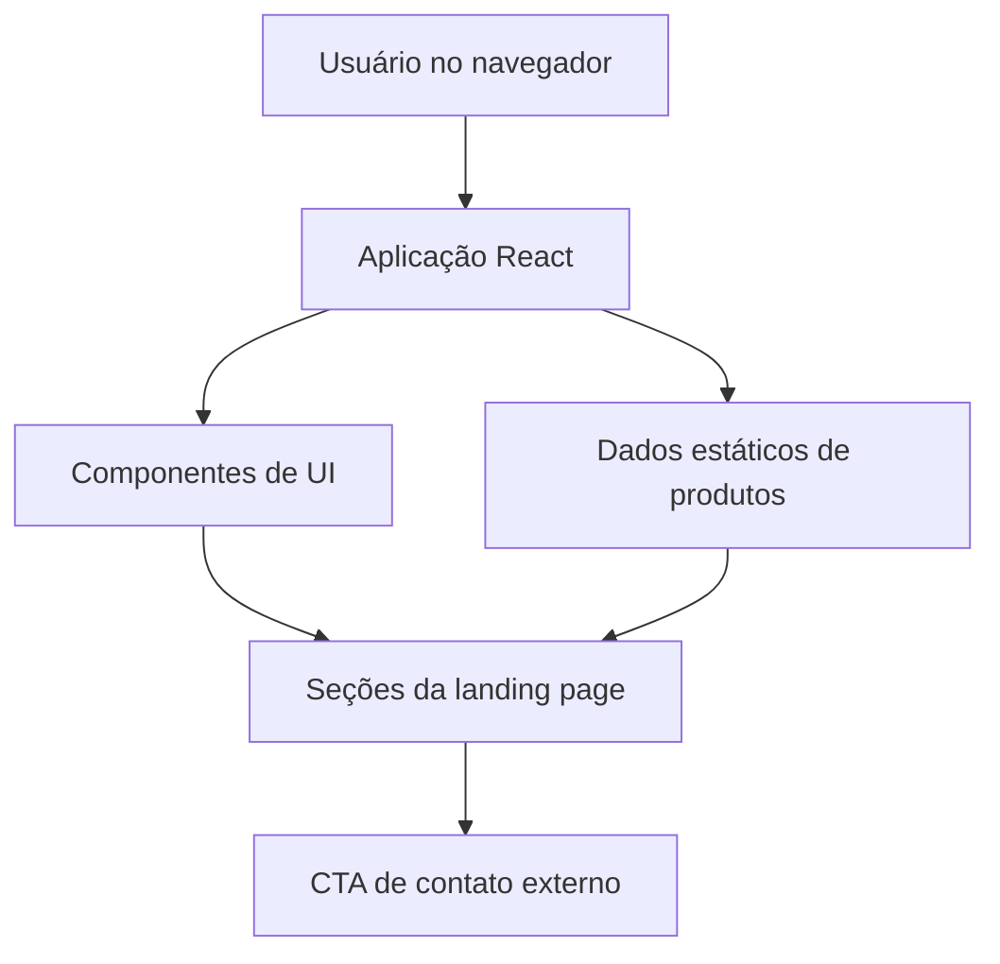

## 1. Desenho da Arquitetura



## 2. Descrição de Tecnologia
- **Frontend**: React@18 + Tailwind CSS@3 + Vite.
- **Ferramenta de inicialização**: Vite.
- **Estilização**: Tailwind com tokens visuais personalizados em CSS variables para cores, sombras, raios e espaçamentos.
- **Animações**: CSS transitions e animações leves para carregamento, hover e elementos sticky.
- **Dados**: arrays locais para categorias, produtos e diferenciais, suficientes para uma primeira versão estática e performática.
- **Serviços externos**: apenas links de contato ou CTA comercial, sem backend obrigatório nesta fase.

## 3. Definições de Rotas
| Rota | Finalidade |
|---|---|
| `/` | Landing page comercial com hero, catálogo, diferenciais e contato. |

## 4. Componentização Planejada
| Componente | Responsabilidade |
|---|---|
| `Header` | Navegação principal, marca textual e CTA fixo. |
| `Hero` | Proposta de valor, CTAs principais e imagem premium. |
| `CategoryShowcase` | Lista visual de famílias de produtos Apple. |
| `FeaturedProducts` | Cards de produtos estratégicos com chamadas comerciais. |
| `TrustBar` | Diferenciais de confiança, garantia e atendimento. |
| `ConsultingSection` | Bloco para compra assistida e orientação personalizada. |
| `ContactSection` | Formulário visual e canais de contato. |
| `Footer` | Links institucionais e reforço de marca. |

## 5. Modelo de Dados

### 5.1 Estruturas TypeScript Sugeridas
```ts
type ProductCategory = {
  name: string;
  description: string;
  highlight: string;
};

type FeaturedProduct = {
  name: string;
  line: string;
  priceFrom: string;
  description: string;
  specs: string[];
  imagePrompt: string;
};

type TrustItem = {
  title: string;
  description: string;
};
```

### 5.2 Persistência
Não há banco de dados nesta fase. Os dados serão mantidos localmente no frontend para acelerar a entrega e reduzir dependências.

## 6. Requisitos Não Funcionais
- **Performance**: página leve, imagens otimizadas por tamanho adequado e sem bibliotecas desnecessárias.
- **Acessibilidade**: contraste AA, foco visível, labels em campos, estrutura semântica e CTAs claros.
- **SEO básico**: título, descrição, hierarquia de headings e conteúdo textual relevante.
- **Manutenibilidade**: seções organizadas, dados separados da marcação e estilos reutilizáveis.
