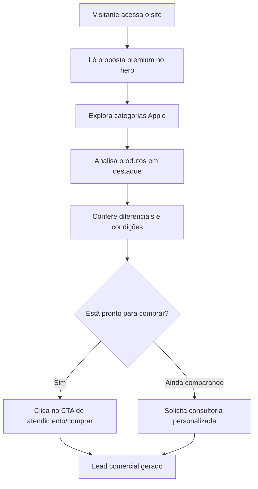

## 1. Visão Geral do Produto
Site institucional e comercial para vender uma linha selecionada de produtos Apple com uma experiência clean, minimalista e altamente profissional.
- O objetivo principal é aumentar conversões por meio de apresentação premium, navegação simples, catálogo curado e chamadas claras para compra ou atendimento.
- O valor de mercado está em transmitir confiança, desejo e sofisticação, aproximando o visitante de uma compra segura e consultiva.

## 2. Funcionalidades Principais

### 2.1 Módulos Funcionais
1. **Página inicial comercial**: hero premium, navegação fixa, destaques de produtos, diferenciais, prova de confiança e chamada final para compra.
2. **Catálogo curado**: cards minimalistas para iPhone, Mac, iPad, Apple Watch e acessórios, com preço inicial e CTA.
3. **Experiência de compra assistida**: bloco de consultoria, benefícios, financiamento, garantia e contato rápido.
4. **Contato e conversão**: CTA para WhatsApp/atendimento, formulário curto e informações de suporte.

### 2.2 Detalhes da Página
| Página | Módulo | Descrição funcional |
|---|---|---|
| Início | Hero principal | Apresenta mensagem de valor, imagem conceitual e CTA para ver ofertas ou falar com consultor. |
| Início | Vitrine de categorias | Exibe famílias Apple com foco em descoberta rápida e navegação visual. |
| Início | Produtos em destaque | Mostra produtos estratégicos com descrição curta, preço inicial e CTA. |
| Início | Diferenciais | Comunica garantia, procedência, entrega, suporte e condições de pagamento. |
| Início | Compra assistida | Direciona usuários indecisos para atendimento consultivo. |
| Início | Formulário/contato | Captura nome, interesse e contato para geração de lead. |

## 3. Processo Principal
O usuário chega pela página inicial, entende rapidamente a proposta de valor, explora categorias ou produtos em destaque, avalia os diferenciais de confiança e escolhe entre iniciar uma conversa comercial ou solicitar atendimento pelo formulário.

## 4. Design da Interface

### 4.1 Estilo Visual
- **Direção estética**: luxo minimalista, tecnológico, claro, preciso e silencioso, inspirado na sensação de showroom premium.
- **Cores principais**: branco neve, grafite profundo, cinza líquido e acentos em azul frio metálico.
- **Botões**: pill buttons com bordas suaves, contraste alto e microinterações discretas.
- **Tipografia**: fonte display refinada para títulos e fonte humanista legível para textos, evitando aparência genérica.
- **Layout**: desktop-first, muito espaço negativo, grid editorial, navegação fixa translúcida e seções bem ritmadas.
- **Ícones**: line icons finos, geométricos e discretos, sem emojis ou ilustrações caricatas.

### 4.2 Visão Geral das Seções
| Página | Módulo | Elementos de UI |
|---|---|---|
| Início | Navegação | Barra superior translúcida, links curtos, CTA compacto e estado sticky. |
| Início | Hero | Título forte, subtítulo objetivo, CTAs duplos, mockup visual via imagem gerada e métricas de confiança. |
| Início | Categorias | Grade minimalista com nomes de linha, descrição curta e hover elegante. |
| Início | Destaques | Cards premium com fundo claro, imagem, especificações-chave e CTA. |
| Início | Diferenciais | Blocos horizontais com ícones lineares, texto curto e hierarquia clara. |
| Início | Consultoria | Seção editorial com CTA de alto contraste para atendimento personalizado. |
| Início | Contato | Formulário limpo, campos essenciais e links de atendimento. |

### 4.3 Responsividade
O projeto será desktop-first, adaptando a hierarquia para tablets e celulares. Em telas pequenas, a navegação vira menu compacto, a vitrine passa para cards empilhados e os CTAs permanecem sempre fáceis de tocar.

### 4.4 Diretrizes de Imagem
- Todas as imagens usadas na interface devem ser geradas pela API obrigatória de imagem do ambiente.
- As imagens devem parecer fotografia editorial realista de produtos premium, sem usar marcas registradas em texto dentro da imagem.
- O hero deve usar composição limpa com dispositivos metálicos, luz suave e fundo de showroom minimalista.
